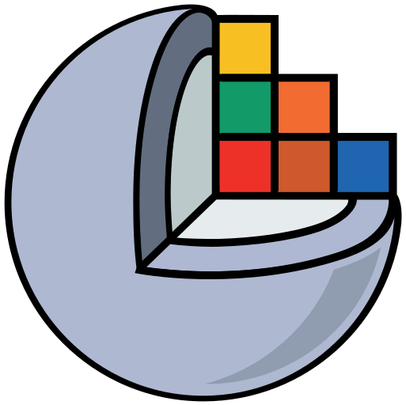
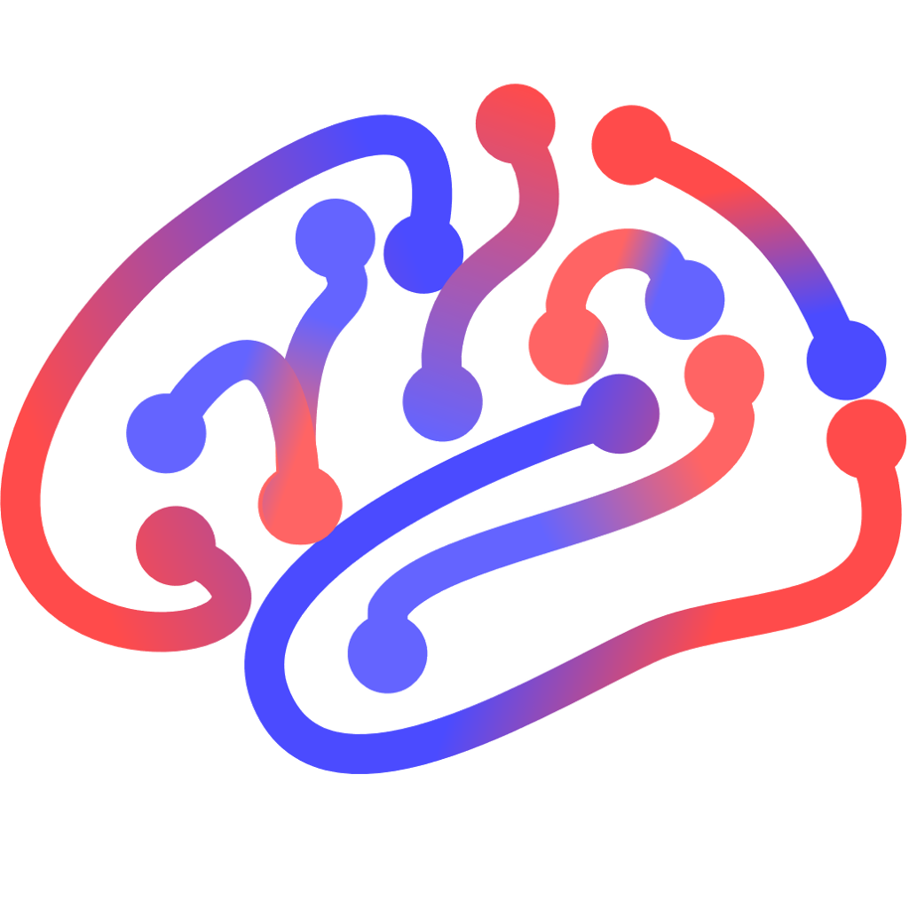

  

  

    
Open profile

     
    

      
    

     
    

      
    

      

      
About me

       
      

        🧠 <b>Name:</b> Yijie Li  
        🎓 <b>Role:</b> PhD Student @ UESTC  
        📍 <b>Location:</b> Chengdu, Sichuan, China  
        🌐 <b>Languages:</b> Chinese, English  
        🔬 <b>Research Interests:</b> Diffusion MRI, Medical Image Analysis, Computational Neuroscience  
        🤝 <b>Collaboration:</b> Open to exciting research collaborations
      

    

    

      
Tools

      

        

          <kbd>
            <kbd>Programming Languages</kbd>
             
             
             
             
            
            
          </kbd>
          <kbd>
            <kbd>Back-end</kbd>
             
             
            
            
          </kbd>
          <kbd>
            <kbd>Front-end</kbd>
             
             
             
              
          </kbd>
           
           
          <kbd>
            <kbd>Data Science & AI</kbd>
             
             
            
            
            
            
          </kbd>
          <kbd>
            <kbd>Operating System, Networking & Deployment</kbd>
             
             
            
      	    
      	    
      	    
            
            
            
            </kbd>
            <kbd>
              <kbd>Terminal Scripts</kbd>
               
               
              
              
              
            </kbd>
            <kbd>
              <kbd>Tools</kbd>
               
               
              
              
          </kbd>
          <kbd>
            <kbd>Medical Imaging & Neuroimaging</kbd>
             
             
            
            
            
            
            
            
            
          </kbd>
        

      

    

  

  
  

